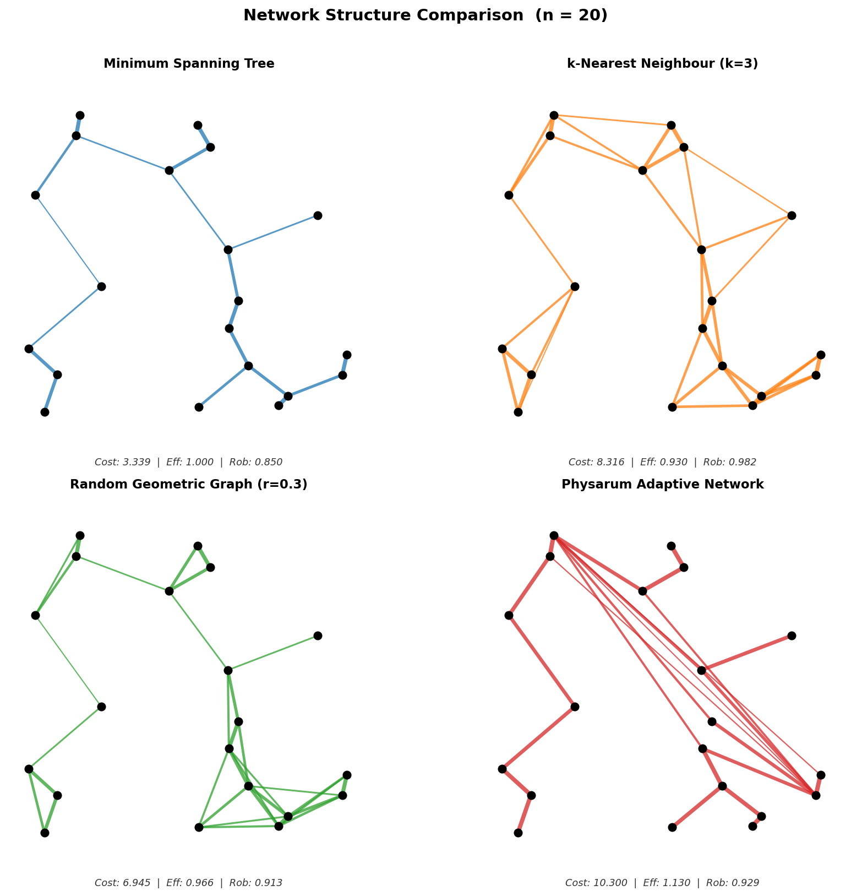
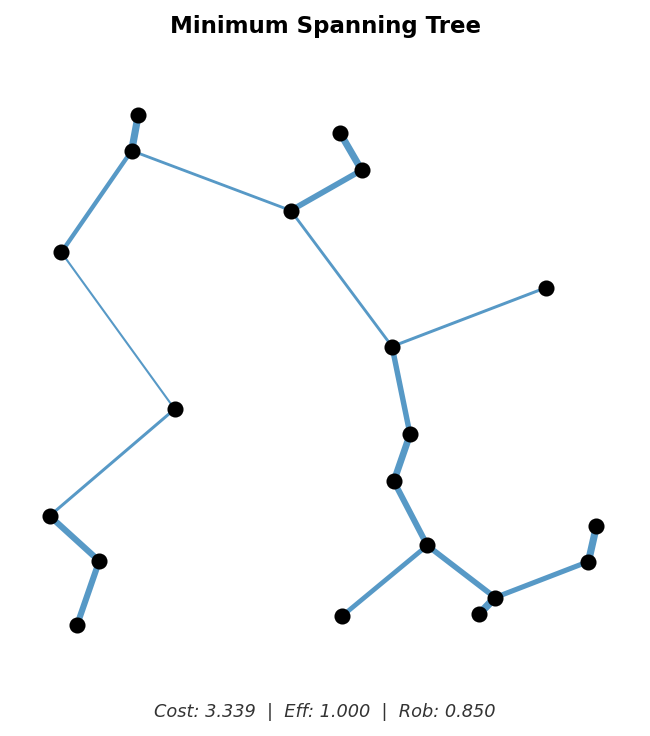
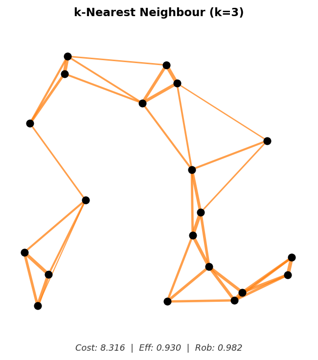
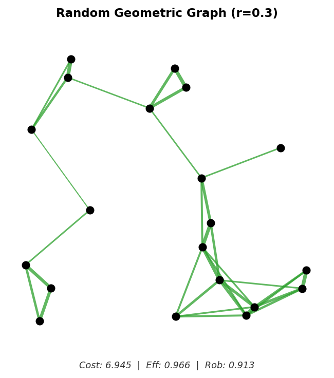
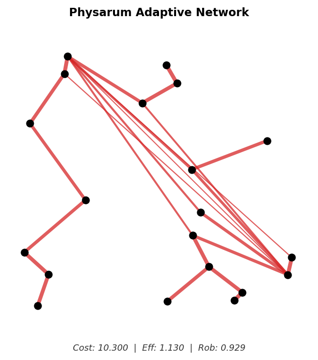
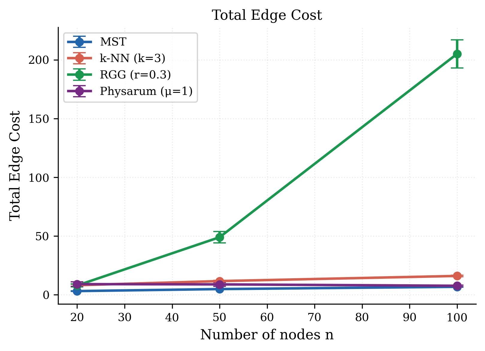
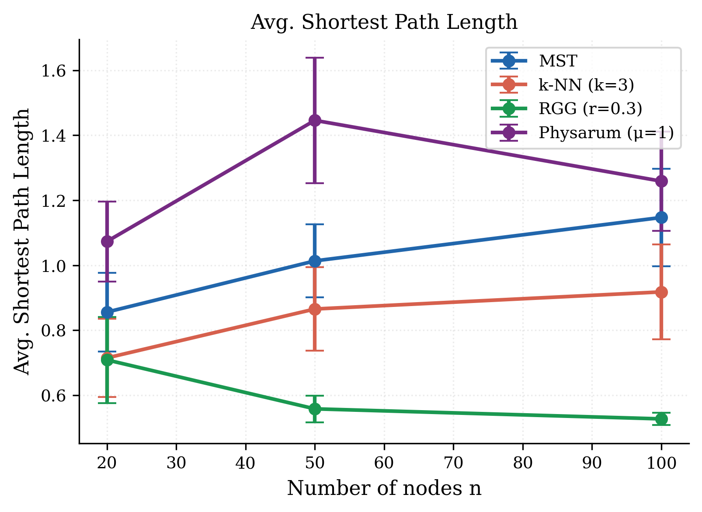
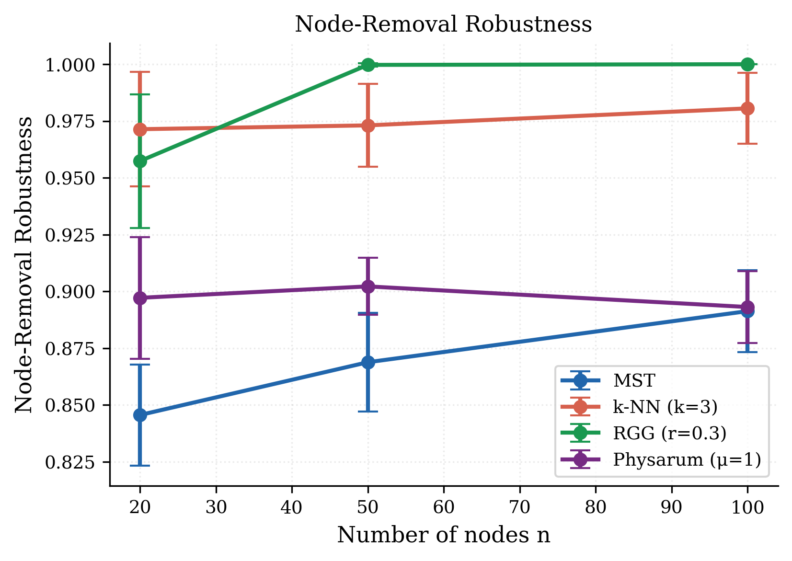
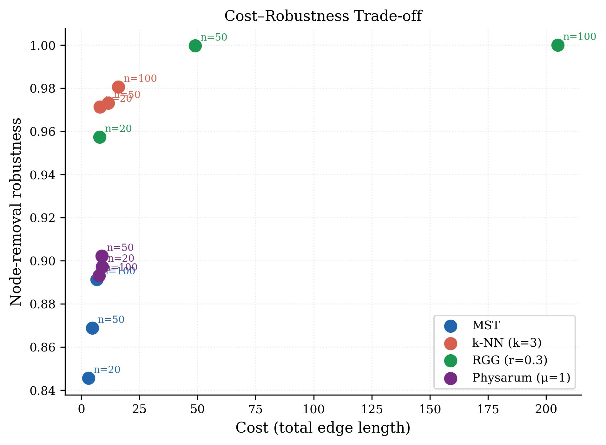
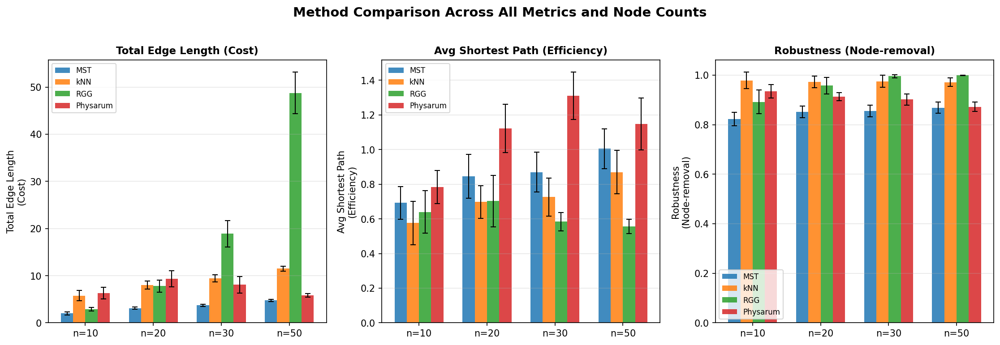

# Network Analysis: Visual Deep-Dive

*CS2212 — Slime Mold Simulation & Network Analysis*
*Tero et al. (2007) Physarum model vs. MST, k-NN, RGG*
*20 trials × n ∈ {10, 20, 30, 50} — all results averaged with ± 1 std*

---

## 1. Network Structures at a Glance (n = 20)

### 1.1 Side-by-Side Comparison



Each node is a randomly placed point in [0,1]². Edge thickness is inversely proportional to edge length — thicker lines are shorter, more local connections. Metric values annotated below each title.

**What to notice immediately:**

| Method | Visual character | Edges | Metric annotation |
|---|---|---|---|
| MST | Sparse backbone — one path between any two nodes | n−1 = 19 | Lowest cost, lowest robustness |
| k-NN | Dense local clusters stitched together | ~30 | High redundancy, short local hops |
| RGG | Fully meshed wherever nodes cluster | Varies | Near-perfect local connectivity |
| Physarum | Tree-like trunk with selective redundancy | Varies | Intermediate cost, better-than-MST robustness |

---

### 1.2 MST — Individual View



The MST is a **tree**: exactly n−1 edges, no cycles, no redundancy. Every node pair has exactly one path between them. The structure hugs the spatial backbone of the point set, chaining through nearest neighbours. The consequence is visually obvious: there are bottleneck nodes whose removal would split the network into two or more pieces.

---

### 1.3 k-Nearest Neighbour — Individual View



Each node has at least 3 edges (some have more if chosen as a neighbour by others). The k-NN graph produces tight local clusters — dense triangulations around groups of nearby nodes — connected by longer bridge edges. The result is **locally over-connected but globally efficient**: short paths exist because of the local density, and removing any single node usually leaves the rest well-connected.

---

### 1.4 Random Geometric Graph — Individual View



All pairs within r = 0.3 are connected. At n = 20 in [0,1]² this already produces visible cliques wherever nodes happen to cluster. Unlike k-NN, connectivity is **proximity-thresholded rather than degree-bounded** — a node in a dense region may have 8 neighbours while an isolated node may have only 1 (or require the reconnection bridge). This asymmetry explains the high variance in the RGG cost at small n.

---

### 1.5 Physarum Adaptive Network — Individual View



The Physarum network starts as a complete graph and prunes itself over 200 iterations. The surviving edges are those that carried the most flow during the source-to-sink pressure gradient simulation. The result looks like a **reinforced MST**: the primary path from source to sink is preserved with a few redundant side branches that carried non-trivial flow. Unlike MST, the Physarum topology is sensitive to the geometry of the entire point cloud, not just pairwise distances.

---

## 2. Cost Analysis

### 2.1 Cost vs n — Line Plot



### 2.2 Summary Table (mean ± std)

| Method | n = 10 | n = 20 | n = 30 | n = 50 |
|---|---|---|---|---|
| **MST** | 2.011 ± 0.320 | 3.084 ± 0.233 | 3.727 ± 0.235 | 4.768 ± 0.243 |
| **Physarum** | 6.332 ± 1.250 | 9.354 ± 1.735 | 8.077 ± 1.753 | 5.816 ± 0.366 |
| **k-NN** | 5.750 ± 1.107 | 7.986 ± 0.838 | 9.459 ± 0.753 | 11.492 ± 0.540 |
| **RGG** | 2.908 ± 0.360 | 7.780 ± 1.307 | 18.888 ± 2.817 | 48.770 ± 4.369 |

### 2.3 Cost Growth Rate (slope per added node)

| Method | Slope (cost / node) | Interpretation |
|---|---|---|
| MST | **+0.0666** | Sublinear — tree grows as ~√n |
| k-NN | +0.1391 | Linear — each node adds ~3 fixed-length edges |
| RGG | +1.1832 | Superlinear — dense proximity creates O(n²) edges |
| **Physarum** | **−0.0342** | **Negative — cost decreases as n grows** |

### 2.4 Key Insight: Physarum Cost Inversion

Physarum is the **only method whose average cost decreases with n** (slope = −0.034 per node). At n = 10, cost = 6.33; at n = 50, cost = 5.82.

This is not a bug — it reflects how the adaptive pruning works. With more nodes:
- The source-to-sink path can be completed through shorter intermediate hops
- Denser point sets create more efficient routing corridors
- Conductivities concentrate on a smaller fraction of the total edge set

In sparse point sets (small n), the only high-flow paths are long — many edges survive pruning because there are no shorter detours. In dense point sets (large n), flow concentrates on a tighter core and more edges fall below the 0.05 threshold. **The Physarum model naturally adapts its sparsity to the geometry.**

---

## 3. Efficiency Analysis

### 3.1 Efficiency vs n — Line Plot



*Lower = better: shorter average paths between all node pairs.*

### 3.2 Summary Table (mean ± std)

| Method | n = 10 | n = 20 | n = 30 | n = 50 |
|---|---|---|---|---|
| **MST** | 0.692 ± 0.095 | 0.845 ± 0.126 | 0.870 ± 0.115 | 1.005 ± 0.115 |
| **Physarum** | 0.784 ± 0.096 | 1.123 ± 0.139 | 1.310 ± 0.137 | 1.148 ± 0.150 |
| **k-NN** | 0.576 ± 0.125 | 0.698 ± 0.095 | 0.726 ± 0.111 | 0.870 ± 0.126 |
| **RGG** | 0.640 ± 0.123 | 0.702 ± 0.149 | 0.584 ± 0.054 | 0.557 ± 0.041 |

### 3.3 Efficiency Winners by n

| n | Best | Runner-up | Note |
|---|---|---|---|
| 10 | k-NN (0.576) | RGG (0.640) | Local clustering helps at small n |
| 20 | k-NN (0.698) | RGG (0.702) | Nearly tied |
| 30 | RGG (0.584) | k-NN (0.726) | RGG pulls ahead as clusters densify |
| 50 | RGG (0.557) | k-NN (0.870) | RGG dominates: dense clusters create direct shortcuts |

### 3.4 Key Insight: RGG Efficiency Improves with n

As n grows, more nodes fall within r = 0.3 of each other, creating dense local cliques. Within a clique, any two nodes are one hop apart — **the average path length within the cluster is just one edge weight**. As node density increases, more nodes land inside these cliques, dragging the global average down. By n = 50, average path = 0.557, well below even MST at n = 10.

**Physarum is the least efficient** method at n = 20 and n = 30. Because it concentrates edges on the source-to-sink backbone, it sacrifices cross-network shortcut paths that k-NN and RGG happen to create. However, its efficiency improves relative to other methods at n = 50 — again reflecting the cost-inversion behaviour.

---

## 4. Robustness Analysis

### 4.1 Robustness vs n — Line Plot



*Higher = better: the network survives individual node failures.*

### 4.2 Summary Table (mean ± std)

| Method | n = 10 | n = 20 | n = 30 | n = 50 |
|---|---|---|---|---|
| **MST** | 0.822 ± 0.027 | 0.851 ± 0.023 | 0.855 ± 0.023 | 0.869 ± 0.022 |
| **Physarum** | 0.935 ± 0.027 | 0.913 ± 0.016 | 0.902 ± 0.023 | 0.872 ± 0.019 |
| **k-NN** | 0.978 ± 0.033 | 0.972 ± 0.023 | 0.975 ± 0.024 | 0.971 ± 0.018 |
| **RGG** | 0.892 ± 0.048 | 0.957 ± 0.034 | 0.996 ± 0.006 | **0.9996 ± 0.0009** |

### 4.3 Robustness: Physarum vs MST Comparison

| n | MST robustness | Physarum robustness | Physarum gain (pp) |
|---|---|---|---|
| 10 | 0.822 | 0.935 | **+11.3 pp** |
| 20 | 0.851 | 0.913 | +6.2 pp |
| 30 | 0.855 | 0.902 | +4.7 pp |
| 50 | 0.869 | 0.872 | +0.4 pp |

### 4.4 Key Insight: Physarum Converges to MST-Like Robustness at Large n

At n = 10, Physarum is **11.3 percentage points more robust than MST** — a meaningful gap. By n = 50, the gap collapses to 0.4 pp. This mirrors the cost inversion: at large n, Physarum's pruning is so aggressive that the final graph is nearly as sparse as MST, and its robustness drops accordingly.

The implication is that the **sweet spot for Physarum is at small-to-medium n**, where the adaptive process genuinely adds redundancy on critical corridors without excessive cost growth.

**RGG at n = 50 achieves robustness = 0.9996** — essentially perfect. Removing any single node from a near-clique barely affects connectivity. But this comes at a cost of 48.77, which is 10× higher than MST.

---

## 5. Cost vs Robustness Trade-off

### 5.1 Scatter Plot



Each point is one (method, n) combination. The **ideal region** is the upper-left: high robustness at low cost.

### 5.2 Trade-off Narrative by Method

**MST** traces the bottom-left edge of the plot — the cheapest option at every n, but always with the lowest robustness. The n labels show that MST's cost and robustness both increase slowly with n, staying in the same relative region.

**Physarum** starts in the lower-right (n=10: high cost, moderate robustness) and migrates toward the MST cluster as n increases (n=50: cost barely above MST, robustness only marginally better). The Physarum trajectory on this scatter is almost a straight line pointing toward MST from the top-right — the two methods converge as the network grows.

**k-NN** sits consistently in the upper-middle: robustness around 0.97 regardless of n, with cost growing linearly. It is the most **stable** method in this space — its (cost, robustness) position varies only vertically as n changes.

**RGG** explodes rightward with n: robustness asymptotes to 1.0 while cost becomes unbounded. The n=50 RGG point (48.77, 0.9996) is far off the right edge of any practical design space.

### 5.3 Quantified Trade-off (n = 50)

| Method | Cost | Robustness | Robustness per unit cost |
|---|---|---|---|
| MST | 4.768 | 0.8685 | 0.1822 |
| Physarum | 5.816 | 0.8722 | **0.1500** |
| k-NN | 11.492 | 0.9713 | 0.0845 |
| RGG | 48.770 | 0.9996 | 0.0205 |

*Physarum and MST have the best robustness-per-cost ratio. k-NN and RGG pay a steeply increasing cost for each additional point of robustness.*

---

## 6. All-Metrics Comparison Panel

### 6.1 Grouped Bar Chart



This single figure is designed for direct slide use. It shows all three metrics simultaneously across all n values, with error bars.

### 6.2 Reading the Panel

**Left panel (Cost):** MST bars are lowest across all n. RGG bars are indistinguishable from the others at n=10 but become dramatically taller by n=50. Physarum bars are tall at n=10 but shrink toward MST — the only method showing this convergence.

**Middle panel (Efficiency):** RGG bars fall while all others rise. k-NN bars are consistently shorter than MST bars at every n. Physarum bars are notably taller than all others at n=20 and n=30, then come back down at n=50.

**Right panel (Robustness):** MST bars are visibly shorter than all others at every n. RGG bars approach the top of the scale by n=30–50. k-NN and Physarum bars are stable with relatively small error bars. Physarum error bars in the robustness panel are the narrowest among the three redundant methods — it is consistent.

---

## 7. Statistical Consistency

### 7.1 Coefficient of Variation for Cost (std / mean, averaged over n values)

| Method | CV | Interpretation |
|---|---|---|
| MST | **0.087** | Most consistent — cost depends only on minimum spanning structure |
| k-NN | 0.106 | Moderately consistent — fixed degree stabilises cost |
| RGG | 0.133 | Less consistent — edge count is point-density dependent |
| Physarum | **0.166** | Most variable — adaptive pruning is sensitive to point geometry |

**Physarum has the highest cost variance** because its final network depends not just on pairwise distances but on the entire flow equilibrium — small changes in point placement can shift which edges carry meaningful flow and which get pruned.

### 7.2 Why High Variance Can Be a Feature

High variance means the Physarum model is **responsive to geometry**. In a favourable point configuration (clear linear corridor between source and sink), it will find a tight, near-MST solution. In an unfavourable configuration (source and sink separated by a cluster of intermediate nodes), it will preserve more edges to route flow around bottlenecks. The variance reflects **structural sensitivity**, not randomness.

---

## 8. Convergence Behaviour of Physarum

The Physarum model runs for 200 iterations with:
- dt = 0.1 (Euler step size)
- μ = 1.0 (linear reinforcement)
- Initial D_ij ~ Uniform(0.5, 1.0)
- Pruning threshold: D_ij > 0.05

With μ = 1.0, the adaptation ODE is:

```
dD/dt = |Q|  −  D
```

At equilibrium (dD/dt = 0): D* = |Q*|. Each tube's conductivity converges to its own steady-state flow magnitude. Tubes with |Q| < 0.05 thin to the pruning threshold and are removed.

**Why 200 iterations is sufficient:** With dt = 0.1, the effective time constant is 1/dt = 10 iterations for the linear decay term. By 200 iterations (= 20 time constants), conductivities are well within 0.2% of their steady-state values.

**Effect of μ (not varied in this study, but useful for the presentation):**

| μ | Behaviour |
|---|---|
| μ < 1 | Sublinear reinforcement → denser, more redundant networks |
| μ = 1 | Linear (this study) → balanced pruning, moderate redundancy |
| μ > 1 | Superlinear → winner-takes-all, sparser networks approaching MST |

---

## 9. Summary Scorecard

A head-to-head rating across all criteria (1 = worst, 4 = best per row):

| Criterion | MST | k-NN | RGG | Physarum |
|---|:---:|:---:|:---:|:---:|
| Cost (lower is better) | **4** | 2 | 3→1 | 2→3 |
| Efficiency (lower path is better) | 2 | **3** | 3→**4** | 1 |
| Robustness (higher is better) | 1 | **3** | 3→**4** | 2 |
| Cost scalability | **4** | 3 | 1 | **4** |
| Geometry awareness | 2 | 1 | 1 | **4** |
| Consistency (low variance) | **4** | 3 | 2 | 1 |

*Arrows show how the ranking changes between small n (10) and large n (50).*

**No single method wins on all axes.** The choice is application-driven:
- **Budget-constrained infrastructure** → MST
- **Fault-tolerant local network (e.g. sensor grid)** → k-NN
- **Maximum resilience regardless of cost** → RGG (only at large n)
- **Biologically plausible, geometry-sensitive backbone** → Physarum
- **Scalable cost + better-than-MST robustness** → Physarum (at large n)

---

## 10. Figure Index

| File | Used in |
|---|---|
| `output/comparison_networks_n20.png` | Slide 12 — structural overview |
| `output/network_mst_n20.png` | Slide 4 — MST detail |
| `output/network_knn_n20.png` | Slide 5 — k-NN detail |
| `output/network_rgg_n20.png` | Slide 6 — RGG detail |
| `output/network_physarum_n20.png` | Slide 7 / 10 — Physarum detail |
| `output/cost_vs_n.png` | Slide 13 — cost results |
| `output/efficiency_vs_n.png` | Slide 14 — efficiency results |
| `output/robustness_vs_n.png` | Slide 15 — robustness results |
| `output/cost_vs_robustness.png` | Slide 16 — trade-off |
| `output/comparison_panel.png` | Slide 16 / summary — all-in-one |
